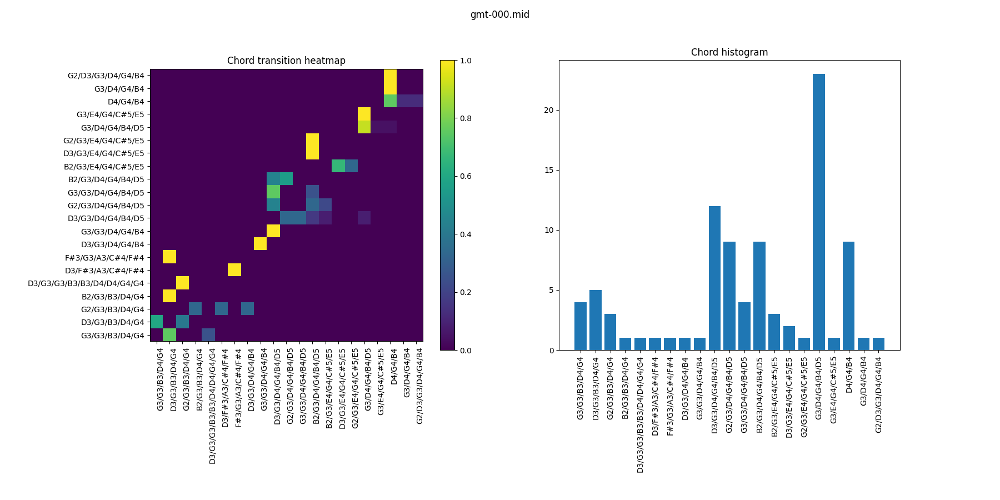
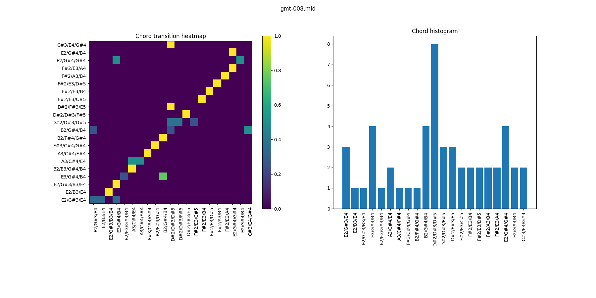

# Miary oparte o akordy

W ramach projektu zostały zaproponowane dwie miary, wysokościowe oraz harmoniczne, oparte o akordy.
Miary te przyjęły postać dwóch statysyk:
- histogramu akordów,
- macierzy przejść akordów.

# Zbiory danych

Metryki zostały przedstawione na utworze "L.v.Beethoven 3mov - Piano Sonata No.4 in Eb Major Op.7" ze zbioru MusicNet[^thickstun2017] oraz dla danych syntetycznych, wygenerowanych z wykorzystaniem różnych narzędzi, m.in.:
- [GiantMusicTransformer][giant_music_transformer] - różne wartości temperatury: 0.9, 0.15, 1.0 ( [GiantMusicTransformer][giant_music_transformer] to nowoczesny wieloinstrumentalny transformer muzyczny. Tymczasem `temperatura` odnosi się do parametru używanego w funkcji softmax, który wpływa na stopień pewności lub różnorodność predykcji modelu. Im wartość jest wyższa tym model jest bardziej różnorodny, a im jest niższa to jest bardziej pewny siebie.),
- [MidiRandomizer][midi_randomizer] - narzędzie do generowania losowych plików MIDI,
- [TensorFlow-RNN][tensorflow-rnn] - różne wartości temperatury: 0.25, 2.0, 3.0 oraz 10.0 ( [TensorFlow-RNN][tensorflow-rnn] to rekurencyjna sieć neuronowa wytrenowana na podzbiorze zestawu danych [MAESTRO][maestro]).

Wygenerowane dane znajdują sie w katalogu `.data\generated` w odpowiednych podfolderach:
- `gmt` - GiantMusicTransformer,
- `mr` - MidiRandomizer,
- `tf_rnn` - TensorFlow-RNN.

Wyniki dla każdego z wygenerowanych zestawów można odtworzyć za pomocą podanych poleceń:
- GiantMusicTransformer - `python -m notebooks.chords_analysis gtm`
- MidiRandomizer - `python -m notebooks.chords_analysis md`
- TensorFlow-RNN - `python -m notebooks.chords_analysis tf_rnn`

# Opis metryk

## Histogram akordów

Funkcja:

chords_histogram

Argumenty:
- `track` - badana ścieżka (obiekt typu `muspy.Track`),
- `readable_output` - w jakim formacie zwrócić akordy (obecnie obsługiwana jest format liczbowy MIDI oraz notacja klawiszowa na pianinie [wartości: 'midi', 'piano']),
- `error_frame` - odstęp jaki może nastąpić pomiędzy poszczególnymi pojedyńczymi nutami by nadal zostały zidentyfikowane jako jeden akord (podawany w impulsach zegarowych). Ze względu na to, że nuty jednego akordu mogą zostać zanotowane z lekkimi opóźnieniami (ze względu na styl grania danej osoby, sposób w jaki został przekonwertowany utwór do MIDI,błąd ludzki lub sprzętowy), wartość ta została wprowadzona by zaniechać identyfikacji kilku mniejszych akordów, gdzie znajduje się jeden pojedynczy akord.

Histogram akordów pozwala na łatwiejszą analizę typu oraz częstości występowania poszczególnych akordów w utworze. Korzystanie z metryki umożliwia sprawniejszą identyfikację utworów z nienaturalnym, odstępującym od normy rozkładem.

&nbsp;*Rys. 1. Przykład histogramu akordów wyliczonego dla utworu nr 151 ze zbioru MusicNet*

## Macierz przejść akordów
Funkcja:

chords_transition_matrix

Argumenty:
- `track` - badana ścieżka (obiekt typu `muspy.Track`),
- `readable_output` - w jakim formacie zwrócić akordy (obecnie obsługiwana jest format liczbowy MIDI oraz notacja klawiszowa na pianinie [wartości: 'midi', 'piano']),
- `error_frame` - odstęp jaki może nastąpić pomiędzy poszczególnymi pojedyńczymi nutami by nadal zostały zidentyfikowane jako jeden akord (podawany w impulsach zegarowych). Ze względu na to, że nuty jednego akordu mogą zostać zanotowane z lekkimi opóźnieniami (ze względu na styl grania danej osoby, sposób w jaki został przekonwertowany utwór do MIDI,błąd ludzki lub sprzętowy), wartość ta została wprowadzona by zaniechać identyfikacji kilku mniejszych akordów, gdzie znajduje się jeden pojedynczy akord.

Macierz przejść akordów przedstawia graficznie prawdopodbieństwa przejścia z jednego akordu do drugiego. Kolorowe punkty na mapie reprezentują przejście z akordu na osi Y do odpowiednieka na osi X.

&nbsp;*Rys. 2. Przykład macierzy przejść akordów wyliczonej dla utworu nr 151 ze zbioru MusicNet*

# Wyniki dla wygenerowanych danych

W przypadku danych z MidiRandomizer oraz TensorFLow-RNN wszystkie wyniki wyglądały identycznie:

&nbsp;*Rys. 3. Macierz przejść i histogram akordów dla pliku 'tf_rnn-000.mid'*

W żadnym z wygenerowanych plików dla obu zbiorów nie zostały wykryte akordy. W obu przypadakach utwory są generowane dźwięk po dźwięku, na wskutek czego nie dochodzi w żadnym momencie do wielobrzmienia.

W przypadku zestawu GiantMusicTransformer pojawiło sie kilka bardziej nadających się do analizy przypadków. W miarę możliwości dla każdego z nich będzie określona jakość utworu oraz jak to jest powiązane z wynikami metryk. 

Utwór `gmt-009.mid` charakteryzuje się brakiem struktury i spójności. Akordy są odgrywane w sposób całkowicie losowy. Macierzą przejść dominuje pojedyncza diagonala, co sugeruje, że prawie nigdy, poza jednym przypadkiem, nie wracamy do wcześniej występujących akordów.
Na histogramie widać rozkład głównie jednorodny, gdzie prawie wszystkie akordy pojawiają się tylko raz. Przykładami danych o podobnej charakterystyce dźwięku oraz podobnych wynikach metryk były: `gmt-002.mid`, `gmt-010.mid` oraz `gmt-011.mid`.

&nbsp;*Rys. 4. Macierz przejść i histogram akordów dla pliku 'gmt-009.mid'*

W przypadku `gmt-000.mid` dominuje jeden akord, pozostałych praktycznie nie widać. Wynikowa macierz przejść nie jest wprost przekątną, ma znacznie większą różnorodność. Histogramem dominuje głównie jeden akord, znajdują się również 4 akordy drugorzędne i pojedyncze wystąpienia innych akordów. Utworami posiadającymi podobny charakter oraz identyczne wyniki metryk były: `gmt-003.mid` oraz `gmt-001.mid`.

&nbsp;*Rys. 5. Macierz przejść i histogram akordów dla pliku 'gmt-000.mid'*

Ekstremalnym przypadkiem dominującego akordu są `gmt-004.mid`, `gmt-005.mid` oraz `gmt-006.mid`, gdzie grany jest prawie wyłącznie tylko jeden akord.  

&nbsp;*Rys. 6. Macierz przejść i histogram akordów dla pliku 'gmt-004.mid'*

Najlepiej brzmiącym utworem był `gmt-008.mid` wygenerowany z temperaturą 1.0. Z wszystkich danych wygenerowanych przy pomocy GiantMusicTransformer, ten charakteryzował się największa spójnością. Wyników dla tego utworu są bardzo zbliżone do utworów ze zbioru MusicNet. W macierzy przejść duże skupienie 'przejść' jest widoczne na przękatnej, z lekkimi wariacjami odbywającymi się co kilka akordów. Na histogramie ponownie zauważamy motyw gdzie dominuje jeden akord, jest kilka akordów drugorzędnych oraz wiele pojedynczych akordów. Po syntezie MIDI jest to też najlepiej brzmiący utwór ze wszystkich wygenerowanych.

&nbsp;*Rys. 7. Macierz przejść i histogram akordów dla pliku 'gmt-008.mid'*

# Wnioski

Metryki te pozwalają zwizualizować akordy w utworze, co pozwala na wstępną analizę czy utwór jest spójny czy nie.

Zarówno kompletny chaos, jak i idealny porządek w postaci przekątnej na wykresie przejść akordów, sugeruje, że utwór nie ma żadnej struktury.

Podobne informacje możemy czerpać z histogramu, gdzie brak dominujących akordów lub zbyt duża dominancja pozbawia utwór oryginalności i struktury. W tym wypadku dobrym podziałem okazał się jeden akord dominujący, ok. 4 akordy o połowie jego częstotliwości występowania oraz bogata ilość innych akordów, które występują rzadko, ok. 1-2 razy.

# Przyszłe rozszerzenia

Potencjalnym punktem rozwoju metryk jest uwzględnienie faktu, że akordy są do siebie podobne, np.:
- akord jest innym akordem wzbogaconym o nutę,
- akord jest innym akordem z pojedynczą zmienioną nutą,
- akord jest innym akordem, ale z nut w innych oktawach,
- akord jest ton wyżej w wybranym kluczu.
Jest to istotne, ponieważ zbliżone do siebie akordy brzmią naturalnie dla ucha ludzkiego, a na obecnych metrykach są ułożone arbitralnie i nie widać po między nimi żadnego połączenia.

# Bibliografia

[^thickstun2017]: ["Learning Features of Music from Scratch", John Thickstun et al., 2017](https://arxiv.org/abs/1611.09827)

[giant_music_transformer]: https://github.com/asigalov61/Giant-Music-Transformer
[midi_randomizer]: https://midirandomizer.sourceforge.net/
[tensorflow-rnn]: https://github.com/tensorflow/docs/blob/master/site/en/tutorials/audio/music_generation.ipynb
[maestro]: https://magenta.tensorflow.org/datasets/maestro