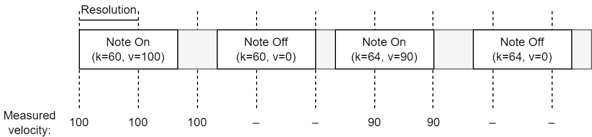
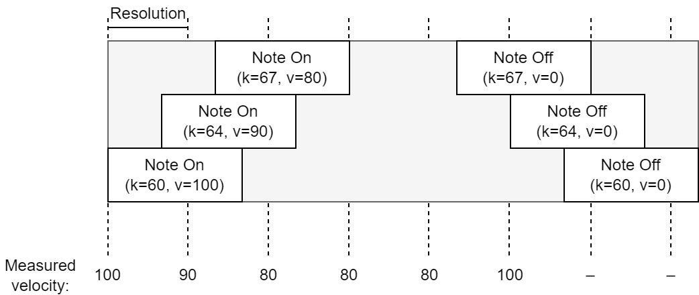

# Miary oparte o dynamikę

W ramach projektu zaproponowane zostały statystyczne miary opisujące dynamikę utworu, cytując:

> liczba zmian głośności: stopniowych (crescendo, decresendo; sąsiedztwo głośności zbliżonych, np. p -> mp) oraz nagłych (sąsiedztwo głośności skrajnych, np. p -> f; akcenty), z podziałem na instrumenty lub całościowo dla utworu

Finalnie metryki te przybrały postać trzech statystyk:

- histogramu wartości dynamiki,
- macierzy przejść wartości dynamiki,
- stosunkowi zmienności dynamiki.

## Zbiory danych

W eksperymencie zostały wykorzystane następujące zbiory danych:

- [MAESTRO][maestro][^hawthorne2018],
- [MusicNet][musicnet][^thickstun2017],
- Zmodyfikowany MusicNet.

## Opis opracowanych metryk

Każda z poniższych metryk umożliwia uruchomienie w dwóch trybach:

- **tryb podstawowy** (`dynamics`) działa na podstawie nieprzetworzonych wartości `velocity` wiadomości MIDI,
- **tryb poziomów** (`dynamics_levels`) dokonuje mapowania wartości `velocity` na poziomy dynamiki, co pozwala na pracę z systemem abstrakcji bliższym środowiskom muzycznym.

Aby zmniejszyć wpływ długich wartości nutowych na statystyki, wartość dynamiki mierzy się w określonych punktach czasowych, równo oddalonych od siebie o jednostkę zwaną rozdzielczością (`resolution`) i podawaną w tickach. Domyślna wartość jednostki wynosi 16, przy wywoływaniu funkcji można jednak ją nadpisać.

:::{figure-md} rys-1

*Rys. 1. Sposób pomiaru wartości dynamiki na przykładzie ścieżki utworu jednogłosowego. Punkty pomiarowe rozdzielone są wartością Resolution*
:::

:::{figure-md} rys-2

*Rys. 2. Sposób pomiaru wartości dynamiki na przykładzie ścieżki utworu wielogłosowego. Punkty pomiarowe rozdzielone są wartością Resolution*
:::

Powyższy rysunek pokazuje, że w każdej jednostce czasowej przetwarzana mogła być więcej niż jedna nuta. W przypadku metryk operujących na ciągłej, logicznie połączonej sekwencji dźwięków konieczne było ograniczenie tej liczby do 1. Zastosowany został podstawowy algorytm oddzielenia głównej melodii od dźwięków pobocznych - uwzględnianie tylko najwyżej położonych nut w każdym punkcie czasowym.

:::{figure-md} rys-3
  

*Rys. 3. Sposób pomiaru wartości dynamiki na przykładzie ścieżki utworu wielogłosowego z ograniczeniem do 1 nuty na punkt pomiarowy. Punkty pomiarowe rozdzielone są wartością Resolution*
:::

### Histogram wartości

Funkcje:

compute_dynamics_histogram

Argumenty:

- `music` - badany utwór (obiekt typu `muspy.Music`),
- `track_idx` - numer badanej ścieżki,
- `resolution` - odstęp pomiędzy momentami próbkowania wartości dynamiki; domyślnie 16,
- `track_start` - pozycja czasowa pierwszej próbki (odległość od początku utworu); domyślnie równa momentowi wystąpienia pierwszej nuty w ścieżce,
- `track_end` - maksymalna przetwarzana pozycja czasowa; domyślnie równa momentowi zakończenia wykonywania ostatniej aktywnej nuty w ścieżce

compute_dynamics_levels_histogram

Argumenty:

- `music` - badany utwór (obiekt typu `muspy.Music`),
- `track_idx` - numer badanej ścieżki,
- `dynamics_levels` - lista poziomów głośności, na które mapowane są wartości `velocity` nut; jest to lista dolnych granic, górną granicę stanowi wartość kolejna pomniejszona o 1 (wartości musza być uporządkowane rosnąco),
- `resolution` - odstęp pomiędzy momentami próbkowania wartości dynamiki; domyślnie 16,
- `track_start` - pozycja czasowa pierwszej próbki (odległość od początku utworu); domyślnie równa momentowi wystąpienia pierwszej nuty w ścieżce,
- `track_end` - maksymalna przetwarzana pozycja czasowa; domyślnie równa momentowi zakończenia wykonywania ostatniej aktywnej nuty w ścieżce

Histogram wartości dynamicznych pozwala na łatwe zapoznanie się z rozkładem poziomów dynamiki w utworze. Korzystając z metryki, można zauważyć niezwiązane z ułożeniem w czasie odstępstwa od normy, takie jak zbyt duży udział wartości skrajnych lub brak wartości dominującej.

:::{figure-md} rys-4
![Przykład histogramu wyliczonego dla ścieżki 1 utworu nr 2433 ze zbioru MusicNet. Po lewej metryka w trybie podstawowym, po prawej w trybie poziomów[^logicpro]](../../images/dynamics/dynamics-histogram-musicnet-2433-t1.png)

*Rys. 4. Przykład histogramu wyliczonego dla ścieżki 1 utworu nr 2433 ze zbioru MusicNet. Po lewej metryka w trybie podstawowym, po prawej w trybie poziomów[^logicpro]*
:::

Stworzenie histogramu odbywa się poprzez zliczenie wystąpień wartości dynamiki w punktach czasowych definiowanych parametrem `resolution`. Pod uwagę brane są wszystkie nuty aktywne w danym punkcie czasowym.

### Macierz przejść wartości

Funkcje:

compute_dynamics_transition_matrix

Argumenty:

- `music` - badany utwór (obiekt typu `muspy.Music`),
- `track_idx` - numer badanej ścieżki,
- `resolution` - odstęp pomiędzy momentami próbkowania wartości dynamiki; domyślnie 16,
- `track_start` - pozycja czasowa pierwszej próbki (odległość od początku utworu); domyślnie równa momentowi wystąpienia pierwszej nuty w ścieżce,
- `track_end` - maksymalna przetwarzana pozycja czasowa; domyślnie równa momentowi zakończenia wykonywania ostatniej aktywnej nuty w ścieżce

compute_dynamics_levels_transition_matrix

Argumenty:

- `music` - badany utwór (obiekt typu `muspy.Music`),
- `track_idx` - numer badanej ścieżki,
- `dynamics_levels` - lista poziomów głośności, na które mapowane są wartości `velocity` nut; jest to lista dolnych granic, górną granicę stanowi wartość kolejna pomniejszona o 1 (wartości musza być uporządkowane rosnąco),
- `resolution` - odstęp pomiędzy momentami próbkowania wartości dynamiki; domyślnie 16,
- `track_start` - pozycja czasowa pierwszej próbki (odległość od początku utworu); domyślnie równa momentowi wystąpienia pierwszej nuty w ścieżce,
- `track_end` - maksymalna przetwarzana pozycja czasowa; domyślnie równa momentowi zakończenia wykonywania ostatniej aktywnej nuty w ścieżce

Macierz przejść pomiędzy wartościami dynamicznymi pozwala poznać szczegóły zmian dynamiki. Istotne jest, jak często przejścia są stopniowe (np. na kolejny poziom), a jak często gwałtowne, skokowe. Macierz przejść pozwala na wygodne odczytanie tej informacji.

:::{figure-md} rys-5
![Przykład macierzy przejść wyliczonej dla ścieżki 1 utworu nr 2433 ze zbioru MusicNet. Po lewej metryka w trybie podstawowym, po prawej w trybie poziomów[^logicpro]](../../images/dynamics/dynamics-matrix-musicnet-2433-t1.png)

*Rys. 5. Przykład macierzy przejść wyliczonej dla ścieżki 1 utworu nr 2433 ze zbioru MusicNet. Po lewej metryka w trybie podstawowym, po prawej w trybie poziomów[^logicpro]*
:::

:::{admonition} Uwaga
:class: danger
Na wykresach prezentujących macierz przejść oś pionowa (po lewej) to wartość poprzednia, a oś pozioma (u dołu) to wartość następna.
:::

Domyślne ustawienia nie ignorują przejść w tę samą wartość. Zwykle dominują one metrykę, ale zawsze może się tu pojawić warte wychwycenia odstępstwo od normy. Aby jednak wizualizacja była bardziej szczegółowa dla pozostałych typów przejść, warto wyzerować główną przekątną.

:::{figure-md} rys-6
![Przykład macierzy przejść wyliczonej dla ścieżki 1 utworu nr 2433 ze zbioru MusicNet z wyzerowaną główną przekątną. Po lewej metryka w trybie podstawowym, po prawej w trybie poziomów[^logicpro]](../../images/dynamics/dynamics-matrix-zero-musicnet-2433-t1.png)

*Rys. 6. Przykład macierzy przejść wyliczonej dla ścieżki 1 utworu nr 2433 ze zbioru MusicNet z wyzerowaną główną przekątną. Po lewej metryka w trybie podstawowym, po prawej w trybie poziomów[^logicpro]*
:::

Rozpatrywanie przejść wymaga istnienia pojedynczej sekwencji dźwięków, więc w tym przypadku w każdym punkcie pomiarowym przetwarzana była maks. 1 nuta (jak na [rys. 3](#rys-3)).

### Stosunek zmienności

Funkcje:

compute_dynamics_variability

Argumenty:

- `music` - badany utwór (obiekt typu `muspy.Music`),
- `track_idx` - numer badanej ścieżki,
- `difference_levels` - lista kategorii różnic, określających znaczność zmian wartości `velocity` nut; jest to lista dolnych granic, górną granicę stanowi wartość kolejna pomniejszona o 1 (wartości musza być uporządkowane rosnąco),
- `resolution` - odstęp pomiędzy momentami próbkowania wartości dynamiki; domyślnie 16,
- `track_start` - pozycja czasowa pierwszej próbki (odległość od początku utworu); domyślnie równa momentowi wystąpienia pierwszej nuty w ścieżce,
- `track_end` - maksymalna przetwarzana pozycja czasowa; domyślnie równa momentowi zakończenia wykonywania ostatniej aktywnej nuty w ścieżce

compute_dynamics_levels_variability

Argumenty:

- `music` - badany utwór (obiekt typu `muspy.Music`),
- `track_idx` - numer badanej ścieżki,
- `difference_levels` - lista kategorii różnic, określających znaczność zmian wartości `velocity` nut; jest to lista dolnych granic, górną granicę stanowi wartość kolejna pomniejszona o 1 (wartości musza być uporządkowane rosnąco),
- `dynamics_levels` - lista poziomów głośności, na które mapowane są wartości `velocity` nut; jest to lista dolnych granic, górną granicę stanowi wartość kolejna pomniejszona o 1 (wartości musza być uporządkowane rosnąco),
- `resolution` - odstęp pomiędzy momentami próbkowania wartości dynamiki; domyślnie 16,
- `track_start` - pozycja czasowa pierwszej próbki (odległość od początku utworu); domyślnie równa momentowi wystąpienia pierwszej nuty w ścieżce,
- `track_end` - maksymalna przetwarzana pozycja czasowa; domyślnie równa momentowi zakończenia wykonywania ostatniej aktywnej nuty w ścieżce

Miarą streszczającą zawartość macierzy przejść jest "zmienność dynamiki" zdefiniowana w niniejszym dokumencie jako stosunek przejść, w których następuje zmiana wartości dynamiki do ogólnej liczby takich przejść. Metrykę można rozumieć również jako sumę elementów macierzy przejść z wyzerowaną przekątną do sumy elementów pełnej macierzy przejść.

Metryka przybliża za pomocą pojedynczej liczby zmienność dynamiki w badanym utworze. Dodatkowo dostępny jest tryb pracy pozwalający na podział zmian na określone kategorie, w szczególności zmiany stopniowe i skokowe.

:::{figure-md} rys-7
![Miara zmienności wyliczona dla ścieżki 1 utworu nr 2433 ze zbioru MusicNet. W pierwszym wierszu metryka w trybie podstawowym, w drugim i trzecim w trybie poziomów[^logicpro] i dla różnych kategorii zmienności](../../images/dynamics/dynamics-variability-musicnet-2433-t1.png)

*Rys. 7 Miara zmienności wyliczona dla ścieżki 1 utworu nr 2433 ze zbioru MusicNet. W pierwszym wierszu metryka w trybie podstawowym, w drugim i trzecim w trybie poziomów[^logicpro] i dla różnych kategorii zmienności*
:::

## Analiza działania metryk

Ponieważ zaprojektowane miary mają w większości postać wizualną i zajmują sporą objętość, poniżej przedstawiono przegląd wyłącznie wybranych przykładów ilustrujący ich działanie. Dalsze eksperymenty można swobodnie przeprowadzać za pomocą dostarczonego pliku notatnika Jupyter [poprzez witrynę Google Colab](https://colab.research.google.com/github/Dove6/WIMU10/blob/main/notebooks/colab_dynamics_metrics.ipynb) albo [lokalnie](../../notebooks/dynamics_metrics.ipynb) (np. z użyciem IDE VS Code).

### Przykłady ze zbioru MusicNet

Zbiór MusicNet zawiera 323 utwory 10 kompozytorów muzyki klasycznej z epok od baroku do I poł. XX wieku. Pliki powstały w wyniku transkrypcji, przez co wartości czasowe oraz dynamiczne są uporządkowane (wyrównane). Umożliwia to sprawdzenie działania miar bez przejmowania się możliwością wystąpienia zakłócającego wartości szumu.

Analiza utworów pochodzących z baroku (nr 2186 - Partita skrzypcowa E-dur cz. 1 J. S. Bacha BWV1006 od [rys. 8](#rys-8) oraz nr 2213 - Preludium i fuga c-moll J. S. Bacha BWV847 od [rys. 12](#rys-12)) pokazuje powściągliwość w stosowaniu zróżnicowanej dynamiki. Występuje kilka określonych poziomów, pomiędzy którymi przejścia następują sporadycznie. Zgadza się to z charakterystyką epoki.

:::{figure-md} rys-8
![Histogram wyliczony dla ścieżki 1 utworu nr 2186 ze zbioru MusicNet. Po lewej metryka w trybie podstawowym, po prawej w trybie poziomów[^logicpro]](../../images/dynamics/dynamics-histogram-musicnet-2186-t1.png)

*Rys. 8. Histogram wyliczony dla ścieżki 1 utworu nr 2186 ze zbioru MusicNet. Po lewej metryka w trybie podstawowym, po prawej w trybie poziomów[^logicpro]*
:::

:::{figure-md} rys-9
![Macierz przejść wyliczona dla ścieżki 1 utworu nr 2186 ze zbioru MusicNet. Po lewej metryka w trybie podstawowym, po prawej w trybie poziomów[^logicpro]](../../images/dynamics/dynamics-matrix-musicnet-2186-t1.png)

*Rys. 9. Macierz przejść wyliczona dla ścieżki 1 utworu nr 2186 ze zbioru MusicNet. Po lewej metryka w trybie podstawowym, po prawej w trybie poziomów[^logicpro]*
:::

:::{figure-md} rys-10
![Macierz przejść wyliczona dla ścieżki 1 utworu nr 2186 ze zbioru MusicNet z wyzerowaną główną przekątną. Po lewej metryka w trybie podstawowym, po prawej w trybie poziomów[^logicpro]](../../images/dynamics/dynamics-matrix-zero-musicnet-2186-t1.png)

*>Rys. 10. Macierz przejść wyliczona dla ścieżki 1 utworu nr 2186 ze zbioru MusicNet z wyzerowaną główną przekątną. Po lewej metryka w trybie podstawowym, po prawej w trybie poziomów[^logicpro]*
:::

:::{figure-md} rys-11
![Miara zmienności wyliczona dla ścieżki 1 utworu nr 2186 ze zbioru MusicNet. Po lewej metryka w trybie podstawowym, po prawej w trybie poziomów[^logicpro]](../../images/dynamics/dynamics-variability-musicnet-2186-t1.png)

*Rys. 11. Miara zmienności wyliczona dla ścieżki 1 utworu nr 2186 ze zbioru MusicNet. Po lewej metryka w trybie podstawowym, po prawej w trybie poziomów[^logicpro]*
:::

:::{figure-md} rys-12
![Histogram wyliczony dla ścieżki 0 utworu nr 2213 ze zbioru MusicNet. Po lewej metryka w trybie podstawowym, po prawej w trybie poziomów[^logicpro]](../../images/dynamics/dynamics-histogram-musicnet-2213-t0.png)

*Rys. 12. Histogram wyliczony dla ścieżki 0 utworu nr 2213 ze zbioru MusicNet. Po lewej metryka w trybie podstawowym, po prawej w trybie poziomów[^logicpro]*
:::

:::{figure-md} rys-13
![Macierz przejść wyliczona dla ścieżki 0 utworu nr 2213 ze zbioru MusicNet. Po lewej metryka w trybie podstawowym, po prawej w trybie poziomów[^logicpro]](../../images/dynamics/dynamics-matrix-musicnet-2213-t0.png)

*Rys. 13. Macierz przejść wyliczona dla ścieżki 0 utworu nr 2213 ze zbioru MusicNet. Po lewej metryka w trybie podstawowym, po prawej w trybie poziomów[^logicpro]*
:::

:::{figure-md} rys-14
![Macierz przejść wyliczona dla ścieżki 0 utworu nr 2213 ze zbioru MusicNet z wyzerowaną główną przekątną. Po lewej metryka w trybie podstawowym, po prawej w trybie poziomów[^logicpro]](../../images/dynamics/dynamics-matrix-zero-musicnet-2213-t0.png)

*Rys. 14. Macierz przejść wyliczona dla ścieżki 0 utworu nr 2213 ze zbioru MusicNet z wyzerowaną główną przekątną. Po lewej metryka w trybie podstawowym, po prawej w trybie poziomów[^logicpro]*
:::

:::{figure-md} rys-15
![Miara zmienności wyliczona dla ścieżki 0 utworu nr 2213 ze zbioru MusicNet. Po lewej metryka w trybie podstawowym, po prawej w trybie poziomów[^logicpro]](../../images/dynamics/dynamics-variability-musicnet-2213-t0.png)

*Rys. 15. Miara zmienności wyliczona dla ścieżki 0 utworu nr 2213 ze zbioru MusicNet. Po lewej metryka w trybie podstawowym, po prawej w trybie poziomów[^logicpro]*
:::

W kontraście do powyższego stoją utwory z epoki romantyzmu. Na przykładzie 3 części Sonaty fortepianowej D-dur F. Schuberta D850 (nr 1777 w zbiorze, od [rys. 16](#rys-16)) widać zastosowanie szerokiego zakresu dynamicznego. Procentowa wartość zmienności jest o rząd wielkości większa w porównaniu do utworów analizowanych wcześniej. Uwidacznia się niedoskonałość zastosowanej metody ograniczania liczby nut w punkcie pomiarowym - wartość ok. 40 dominuje w macierzy przejść, ale w histogramie dużo większy udział mają wartości powyżej 80. Wątpliwe jest, by w sekwencji stanowiącej główną melodię przeważały niskie wartości głośności, podczas gdy reszta utworu wykorzystuje wartości większe.

:::{figure-md} rys-16
![Histogram wyliczony dla ścieżki 1 utworu nr 1777 ze zbioru MusicNet. Po lewej metryka w trybie podstawowym, po prawej w trybie poziomów[^logicpro]](../../images/dynamics/dynamics-histogram-musicnet-1777-t1.png)

*Rys. 16. Histogram wyliczony dla ścieżki 1 utworu nr 1777 ze zbioru MusicNet. Po lewej metryka w trybie podstawowym, po prawej w trybie poziomów[^logicpro]*
:::

:::{figure-md} rys-17
![Macierz przejść wyliczona dla ścieżki 1 utworu nr 1777 ze zbioru MusicNet. Po lewej metryka w trybie podstawowym, po prawej w trybie poziomów[^logicpro]](../../images/dynamics/dynamics-matrix-musicnet-1777-t1.png)

*Rys. 17. Macierz przejść wyliczona dla ścieżki 1 utworu nr 1777 ze zbioru MusicNet. Po lewej metryka w trybie podstawowym, po prawej w trybie poziomów[^logicpro]*
:::

:::{figure-md} rys-18
![Macierz przejść wyliczona dla ścieżki 1 utworu nr 1777 ze zbioru MusicNet z wyzerowaną główną przekątną. Po lewej metryka w trybie podstawowym, po prawej w trybie poziomów[^logicpro]](../../images/dynamics/dynamics-matrix-zero-musicnet-1777-t1.png)

*Rys. 18. Macierz przejść wyliczona dla ścieżki 1 utworu nr 1777 ze zbioru MusicNet z wyzerowaną główną przekątną. Po lewej metryka w trybie podstawowym, po prawej w trybie poziomów[^logicpro]*
:::

:::{figure-md} rys-19
![Miara zmienności wyliczona dla ścieżki 1 utworu nr 1777 ze zbioru MusicNet. Po lewej metryka w trybie podstawowym, po prawej w trybie poziomów[^logicpro]](../../images/dynamics/dynamics-variability-musicnet-1777-t1.png)

*Rys. 19. Miara zmienności wyliczona dla ścieżki 1 utworu nr 1777 ze zbioru MusicNet. Po lewej metryka w trybie podstawowym, po prawej w trybie poziomów[^logicpro]*
:::

### Przykłady ze zbioru MAESTRO-V3

Podobnie jak zbiór MusicNet, zbiór MAESTRO-V3 skupia się na muzyce klasycznej, ale nie powstał poprzez transkrypcję, a poprzez nagranie wyjścia instrumentu MIDI w czasie gry na żywo. Ze względu na taki sposób przechwycenia danych, wartości czasowe i dynamiczne powstałych plików MIDI nie są dokładnie wyrównane do podziałów czasowych. Powoduje to, że zdecydowanie bardziej sensowne użycie jest metryk w trybie poziomów, nie zaś w trybie podstawowym, biorącym pod uwagę nawet najdrobniejsze zmiany wartości dynamiki.

Podobnie jak w poprzednim przypadku, sprawdzone zostały utwory pochodzące z epoki baroku (Suita francuska nr 5 G-dur J. S. Bacha BWV816, nr 720 w zbiorze, od [rys. 20](#rys-20)) oraz romantyzmu (ponownie Sonata D-dur F. Schuberta D850, nr 451 z biorze, od [rys. 24](#rys-24)).

Wizualizacja metryk nie pozostawia wątpliwości co do skali wpływu sposobu wytwarzania plików MIDI oraz wirtuozerskiego sposobu wykonania na rozkład wartości dynamiki. Podczas gdy dla poprzedniego zbioru na wykresach wartości przyjmowały jedynie nieliczne słupki, tak dla zbioru MAESTRO-V3 histogramy oraz macierze przejść przedstawiają zakresy, w których brak wartości zerowych ("dziur"). Rozkład wartości dla pierwszego utworu jest bardziej skupiony, oba natomiast mają łagodne brzegi, mogące świadczyć o występowaniu szumu oraz po prostu czynnika ludzkiego w tworzeniu nagrania.

:::{figure-md} rys-20
![Histogram wyliczony dla ścieżki 0 utworu nr 720 ze zbioru MAESTRO-V3. Po lewej metryka w trybie podstawowym, po prawej w trybie poziomów[^logicpro]](../../images/dynamics/dynamics-histogram-maestro-720-t0.png)

*Rys. 20. Histogram wyliczony dla ścieżki 0 utworu nr 720 ze zbioru MAESTRO-V3. Po lewej metryka w trybie podstawowym, po prawej w trybie poziomów[^logicpro]*
:::

:::{figure-md} rys-21
![Macierz przejść wyliczona dla ścieżki 0 utworu nr 720 ze zbioru MAESTRO-V3. Po lewej metryka w trybie podstawowym, po prawej w trybie poziomów[^logicpro]](../../images/dynamics/dynamics-matrix-maestro-720-t0.png)

*Rys. 21. Macierz przejść wyliczona dla ścieżki 0 utworu nr 720 ze zbioru MAESTRO-V3. Po lewej metryka w trybie podstawowym, po prawej w trybie poziomów[^logicpro]*
:::

:::{figure-md} rys-22
![Macierz przejść wyliczona dla ścieżki 0 utworu nr 720 ze zbioru MAESTRO-V3 z wyzerowaną główną przekątną. Po lewej metryka w trybie podstawowym, po prawej w trybie poziomów[^logicpro]](../../images/dynamics/dynamics-matrix-zero-maestro-720-t0.png)

*Rys. 22. Macierz przejść wyliczona dla ścieżki 0 utworu nr 720 ze zbioru MAESTRO-V3 z wyzerowaną główną przekątną. Po lewej metryka w trybie podstawowym, po prawej w trybie poziomów[^logicpro]*
:::

:::{figure-md} rys-23
![Miara zmienności wyliczona dla ścieżki 0 utworu nr 720 ze zbioru MAESTRO-V3. Po lewej metryka w trybie podstawowym, po prawej w trybie poziomów[^logicpro]](../../images/dynamics/dynamics-variability-maestro-720-t0.png)

*Rys. 23. Miara zmienności wyliczona dla ścieżki 0 utworu nr 720 ze zbioru MAESTRO-V3. Po lewej metryka w trybie podstawowym, po prawej w trybie poziomów[^logicpro]*
:::

:::{figure-md} rys-24
![Histogram wyliczony dla ścieżki 0 utworu nr 451 ze zbioru MAESTRO-V3. Po lewej metryka w trybie podstawowym, po prawej w trybie poziomów[^logicpro]](../../images/dynamics/dynamics-histogram-maestro-451-t0.png)

*Rys. 24. Histogram wyliczony dla ścieżki 0 utworu nr 451 ze zbioru MAESTRO-V3. Po lewej metryka w trybie podstawowym, po prawej w trybie poziomów[^logicpro]*
:::

:::{figure-md} rys-25
![Macierz przejść wyliczona dla ścieżki 0 utworu nr 451 ze zbioru MAESTRO-V3. Po lewej metryka w trybie podstawowym, po prawej w trybie poziomów[^logicpro]](../../images/dynamics/dynamics-matrix-maestro-451-t0.png)

*Rys. 25. Macierz przejść wyliczona dla ścieżki 0 utworu nr 451 ze zbioru MAESTRO-V3. Po lewej metryka w trybie podstawowym, po prawej w trybie poziomów[^logicpro]*
:::

:::{figure-md} rys-26
![Macierz przejść wyliczona dla ścieżki 0 utworu nr 451 ze zbioru MAESTRO-V3 z wyzerowaną główną przekątną. Po lewej metryka w trybie podstawowym, po prawej w trybie poziomów[^logicpro]](../../images/dynamics/dynamics-matrix-zero-maestro-451-t0.png)

*Rys. 26. Macierz przejść wyliczona dla ścieżki 0 utworu nr 451 ze zbioru MAESTRO-V3 z wyzerowaną główną przekątną. Po lewej metryka w trybie podstawowym, po prawej w trybie poziomów[^logicpro]*
:::

:::{figure-md} rys-27
![Miara zmienności wyliczona dla ścieżki 0 utworu nr 451 ze zbioru MAESTRO-V3. Po lewej metryka w trybie podstawowym, po prawej w trybie poziomów[^logicpro]](../../images/dynamics/dynamics-variability-maestro-451-t0.png)

*Rys. 27. Miara zmienności wyliczona dla ścieżki 0 utworu nr 451 ze zbioru MAESTRO-V3. Po lewej metryka w trybie podstawowym, po prawej w trybie poziomów[^logicpro]*
:::

### Zmodyfikowane przykłady ze zbioru MusicNet

Wykonanych zostało również kilka eksperymentów na danych syntetycznych wygenerowanych poprzez zmianę wartości dynamiki utworu 2186 pochodzącego ze zbioru danych MusicNet. Wartości zostały zmodyfikowane za pomocą prostego skryptu napisanego w języku Python. Skrypt zawarty jest w repozytorium: [dynamics_randomizer.py](../../notebooks/dynamics_randomizer.py) i umożliwia nadpisanie wartości dynamiki z użyciem wartości losowych.

Pierwsze zaprezentowane poniżej przekształcenie zakładało pełną losowość dynamiki w zakresie wartości od 1 do 127 włącznie. Wykonana operacja sprawiała, że utwór stawał się nieprzyjemny w odsłuchu. Niektóre dźwięki znikały przez zbyt niski poziom głośności. Ciężko było wysłyszeć odgrywane frazy melodii. Pomimo że sytuacja odwzorowana jest również na histogramie, to znacznie istotniejszą informację niesie tutaj macierz przejść - przejście przez cały zakres dynamiki w określonej kolejności mogłoby mieć jakiś sens muzyczny, struktura przejść jest jednak chaotyczna.

:::{figure-md} rys-28
![Histogram wyliczony dla ścieżki 0 utworu nr 0 ze zbioru stanowiącego przetworzenie utworu nr 2186 ze zbioru MusicNet. Po lewej metryka w trybie podstawowym, po histogram w trybie poziomów[^logicpro]](../../images/dynamics/dynamics-histogram-rand-000-t0.png)

*Rys. 28. Histogram wyliczony dla ścieżki 0 utworu nr 0 ze zbioru stanowiącego przetworzenie utworu nr 2186 ze zbioru MusicNet. Po lewej metryka w trybie podstawowym, po prawej w trybie poziomów[^logicpro]*
:::

:::{figure-md} rys-29
![Macierz przejść wyliczona dla ścieżki 0 utworu nr 0 ze zbioru stanowiącego przetworzenie utworu nr 2186 ze zbioru MusicNet. Po lewej metryka w trybie podstawowym, po prawej w trybie poziomów[^logicpro]](../../images/dynamics/dynamics-matrix-rand-000-t0.png)

*Rys. 29. Macierz przejść wyliczona dla ścieżki 0 utworu nr 0 ze zbioru stanowiącego przetworzenie utworu nr 2186 ze zbioru MusicNet. Po lewej metryka w trybie podstawowym, po prawej w trybie poziomów[^logicpro]*
:::

:::{figure-md} rys-30
![Macierz przejść wyliczona dla ścieżki 0 utworu nr 0 ze zbioru stanowiącego przetworzenie utworu nr 2186 ze zbioru MusicNet z wyzerowaną główną przekątną. Po lewej metryka w trybie podstawowym, po prawej w trybie poziomów[^logicpro]](../../images/dynamics/dynamics-matrix-zero-rand-000-t0.png)

*Rys. 30. Macierz przejść wyliczona dla ścieżki 0 utworu nr 0 ze zbioru stanowiącego przetworzenie utworu nr 2186 ze zbioru MusicNet z wyzerowaną główną przekątną. Po lewej metryka w trybie podstawowym, po prawej w trybie poziomów[^logicpro]*
:::

:::{figure-md} rys-31
![Miara zmienności wyliczona dla ścieżki 0 utworu nr 0 ze zbioru stanowiącego przetworzenie utworu nr 2186 ze zbioru MusicNet. Po lewej metryka w trybie podstawowym, po prawej w trybie poziomów[^logicpro]](../../images/dynamics/dynamics-variability-rand-000-t0.png)

*Rys. 31. Miara zmienności wyliczona dla ścieżki 0 utworu nr 0 ze zbioru stanowiącego przetworzenie utworu nr 2186 ze zbioru MusicNet. Po lewej metryka w trybie podstawowym, po prawej w trybie poziomów[^logicpro]*
:::

Kolejny eksperyment zakładał ustawienie maksymalnej wartości dynamiki dla całego utworu. Wbrew pozorom odsłuch tak przetworzonego utworu nie jest w żaden sposób nieprzyjemny, ponieważ pomiędzy wyjście z programowego syntezatora MIDI a uszami odbiorcy mieści się jeszcze szereg pokręteł odpowiedzialnych za ustawienie głośności. Zarówno histogram, jak i macierz przejść pozwalają jednoznacznie określić, jak wygląda schemat dynamiczny utworu. Zgodnie z oczekiwaniami miara zmienności dynamiki wynosi 0.

:::{figure-md} rys-32
![Histogram wyliczony dla ścieżki 0 utworu nr 1 ze zbioru stanowiącego przetworzenie utworu nr 2186 ze zbioru MusicNet. Po lewej metryka w trybie podstawowym, po histogram w trybie poziomów[^logicpro]](../../images/dynamics/dynamics-histogram-rand-001-t0.png)

*Rys. 32. Histogram wyliczony dla ścieżki 0 utworu nr 1 ze zbioru stanowiącego przetworzenie utworu nr 2186 ze zbioru MusicNet. Po lewej metryka w trybie podstawowym, po prawej w trybie poziomów[^logicpro]*
:::

:::{figure-md} rys-33
![Macierz przejść wyliczona dla ścieżki 0 utworu nr 1 ze zbioru stanowiącego przetworzenie utworu nr 2186 ze zbioru MusicNet. Po lewej metryka w trybie podstawowym, po prawej w trybie poziomów[^logicpro]](../../images/dynamics/dynamics-matrix-rand-001-t0.png)

*Rys. 33. Macierz przejść wyliczona dla ścieżki 0 utworu nr 1 ze zbioru stanowiącego przetworzenie utworu nr 2186 ze zbioru MusicNet. Po lewej metryka w trybie podstawowym, po prawej w trybie poziomów[^logicpro]*
:::

:::{figure-md} rys-34
![Macierz przejść wyliczona dla ścieżki 0 utworu nr 1 ze zbioru stanowiącego przetworzenie utworu nr 2186 ze zbioru MusicNet z wyzerowaną główną przekątną. Po lewej metryka w trybie podstawowym, po prawej w trybie poziomów[^logicpro]](../../images/dynamics/dynamics-matrix-zero-rand-001-t0.png)

*Rys. 34. Macierz przejść wyliczona dla ścieżki 0 utworu nr 1 ze zbioru stanowiącego przetworzenie utworu nr 2186 ze zbioru MusicNet z wyzerowaną główną przekątną. Po lewej metryka w trybie podstawowym, po prawej w trybie poziomów[^logicpro]*
:::

:::{figure-md} rys-35
![Miara zmienności wyliczona dla ścieżki 0 utworu nr 1 ze zbioru stanowiącego przetworzenie utworu nr 2186 ze zbioru MusicNet. Po lewej metryka w trybie podstawowym, po prawej w trybie poziomów[^logicpro]](../../images/dynamics/dynamics-variability-rand-001-t0.png)

*Rys. 35. Miara zmienności wyliczona dla ścieżki 0 utworu nr 1 ze zbioru stanowiącego przetworzenie utworu nr 2186 ze zbioru MusicNet. Po lewej metryka w trybie podstawowym, po prawej w trybie poziomów[^logicpro]*
:::

## Podsumowanie i możliwości rozwoju

Pomimo że opracowane metryki dotyczące dynamiki stanowią uproszczenie właściwości utworu, są przeznaczone do użytku raczej przez człowieka niż przez mechanizmy oceniające automatycznie jakość modeli uczenia maszynowego w kolejnych krokach ich uczenia. Spowodowane jest to ich niejednoznacznością. Na podstawie zarówno histogramu, jak i macierzy przejść można wykryć pewne problemy z utworem. Nie istnieje jednak prosta zależność pomiędzy wartością metryk a pozytywnymi/negatywnymi wrażeniami słuchowymi towarzyszącymi odbiorowi utworu.

Warto również zwrócić uwagę na znaczenie dynamiki w generowanych utworach - nie jest ona podstawową cechą wpływającą na jakość, a dodatkowym akcentem mogącym sprawić, że utwór będzie brzmiał lepiej. Widać to doskonale na przykładzie badanego zbioru danych MAESTRO, gdzie wirtuozi fortepianu nawet grając utwory o ograniczonym zakresie dynamicznym umiejętnie operowali siłą uderzenia, zwiększając ich ekspresję. Modele zajmujące się generowaniem muzyki mogą przyjąć bezpieczne, stałe ustawienia wartości dynamiki (potencjalnie na podstawie zdefiniowanych wcześniej konfiguracji dla konkretnych ścieżek/instrumentów) i wciąż dawać w pełni akceptowalne wyniki.

Jeśli chodzi o możliwości dalszego rozwijania tematu metryk powiązanych z dynamiką, warto skupić badania na miarach mniejszej objętości, najlepiej możliwych do wyrażenia za pomocą pojedynczej liczby. Miary takie warto skorelować z wynikami subiektywnych testów jakości utworu typu MUSHRA - należy jednak pamiętać, by nie zmieniać np. melodii, a jedynie zachowanie dynamiki. W powyższych eksperymentach istotną subiektywną obserwacją było, że nieprzyjemna dla ucha nie jest wysoka zmienność dynamiki, a jej chaotyczny charakter. Możliwe, że wypracowanie miary definiującej stopień uporządkowania przejść dynamicznych stanowiłoby rozwiązanie dobre zarówno dla człowieka, jak i mechanizmu trenującego model uczenia maszynowego.

## Bibliografia

[^logicpro]: Zgodnie z poziomami zdefiniowanymi w oprogramowaniu Logic Pro.

[^hawthorne2018]: ["Enabling Factorized Piano Music Modeling and Generation with the MAESTRO Dataset", Curtis Hawthorne et.al., 2019](https://openreview.net/forum?id=r1lYRjC9F7)
[^thickstun2017]: ["Learning Features of Music from Scratch", John Thickstun et al., 2017](https://arxiv.org/abs/1611.09827)

[maestro]: https://magenta.tensorflow.org/datasets/maestro
[musicnet]: https://www.kaggle.com/datasets/imsparsh/musicnet-dataset
