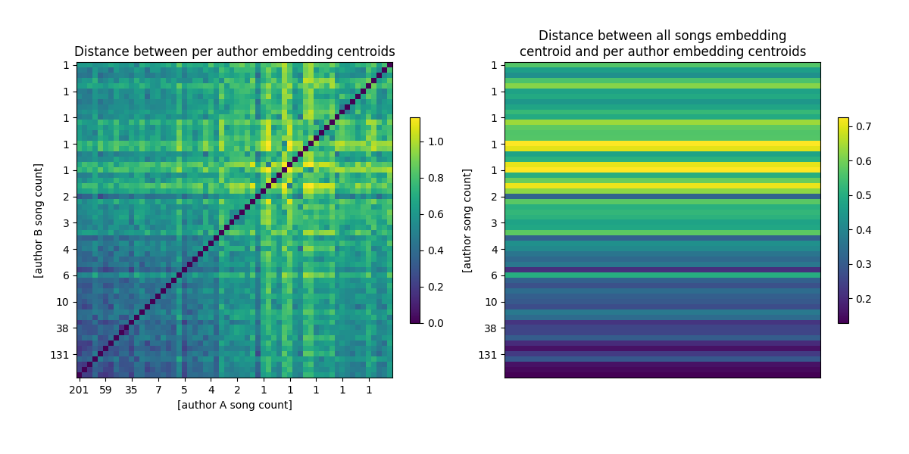

# Cel

Celem tego eksperymentu jest weryfikacja, czy embeddingi utworów, wytworzone przez model uczenia maszynowego, mogą służyć za metryki.

# Wykorzystane zasoby

Zbiór danych Maestro w wersji 3.
TODO: gdzieś masz linka


Model [CLaMP](https://github.com/microsoft/muzic/tree/main/clamp)
Silnie zmodyfikowany interfejs użytkownika:
- zamiast formatu wejściowego MusicXML, używamy ABC (był on używany wewnętrznie)
- argumenty to wejściowy folder z plikami ABC i wyjściowy folder gdzie trafią pliki JSON
- obsługiwanie wielu utworów na raz (batching)
- zapisywanie embeddingów utworów do plików JSON
- usunięcie fragmentu
Model w wersji `sander-wood/clamp-small-512`


Narzędzie do bezpośredniej zamiany formatu MIDI na format ABC [midi2abc](https://github.com/sshlien/abcmidi)
Zamiana MIDI do MusicXML poprzez `muspy` nie działała, ponieważ utwory ze zbioru Maestro miał zbyt krótkie nuty i konwerter nie był sobie w stanie z tym poradzić.
Nie wiemy też, czy format pośredni zachowywał wszystkie informacie.
Alternatywny konwerter pozwalał obsłużyć krótkie nuty, posiadał też bogatą paletę opcji, które nie były nam potrzebne.
Jest też kilkakrotnie szybszy, bo stworzony został dokładnie do tego typu operacji.

# Uruchomienie

Do tego eksperymentu wymagany jest Python w wersji 3.9.X, jest to narzucone przez kod użyty do modelu CLaMP.

Przetważanie zaczyna się od pobrania zbioru maestro:
```sh
py -m setup_database maestro
```

Następnie należy go przekonwertować z formatu MIDI do ABC i przekazać do modelu:
```sh
py -3.9 -m notebooks.clamp.statistics
```

Formaty ABC i embeddingi zostaną zapisane równolegle ze zbiorem maestro w folderze `data`.

# Wyniki

W ramach eksperymentu, każdy utwór ze zbioru Maestro został przetworzony do formatu ABC, a następnie przekazany do modelu, którego wyniki w postaci embeddingów zostały zapisane w plikach o formacie JSON.

## Wariancja wewnątrz-grupowa

Obliczona została wariancja wartości embeddingów dla każdej grupy (wszystkie utwory, per autor).
W celu ograniczenia informacji przedstawiamy tylko skrajne wartości wariancji każdej grupy.

Wysoka wariancja embeddingów świadczy o dużym zróżnicowaniu badanego zbioru utworów.
Oczekujemy, że utwory bardziej do siebie zbliżone, np. pochodzące od tego samego autora, będą miały niższą wariancję.

Ograniczamy się do twórców z conajmniej 5 utworami, bo wariancja dla jednego elementu naturalnie dąży do wartości zerowej.
Przed analizą wyniki zostały poddane normalizacji warstwowej, co jest bliższe podobieństwu cosinusowemu (na którym model znajduje podobieństwa utworów i tekstów) niż nieznormalizowane wyniki.
*Matematyka opisana w komentarzu tutaj: https://stackoverflow.com/questions/46409846/using-k-means-with-cosine-similarity-python*

|                  Group or author                   | Songs | Min variance | Max variance |
|----------------------------------------------------|-------|--------------|--------------|
|                      Everyone                      |  1276 |  0.000144711 |  0.001036201 |
|                  Frédéric Chopin                   |   201 |  0.000111078 |  0.001129670 |
|                   Franz Schubert                   |   186 |  0.000123212 |  0.000989144 |
|                Ludwig van Beethoven                |   146 |  0.000080254 |  0.001168862 |
|               Johann Sebastian Bach                |   145 |  0.000089840 |  0.001427169 |
|                    Franz Liszt                     |   131 |  0.000076927 |  0.000982589 |
|                Sergei Rachmaninoff                 |    59 |  0.000108146 |  0.001524104 |
|                  Robert Schumann                   |    49 |  0.000064694 |  0.001090892 |
|                   Claude Debussy                   |    45 |  0.000055400 |  0.001433067 |
|                    Joseph Haydn                    |    40 |  0.000051574 |  0.001091413 |
|              Wolfgang Amadeus Mozart               |    38 |  0.000053393 |  0.000916717 |
|                 Alexander Scriabin                 |    35 |  0.000036396 |  0.000824718 |
|                 Domenico Scarlatti                 |    31 |  0.000062661 |  0.001180399 |
|                 Felix Mendelssohn                  |    28 |  0.000017502 |  0.000799530 |
|                  Johannes Brahms                   |    26 |  0.000038023 |  0.001100190 |
|            Franz Schubert / Franz Liszt            |    10 |  0.000041989 |  0.001269710 |
|                   Isaac Albéniz                    |     7 |  0.000015711 |  0.004365234 |
|     Pyotr Ilyich Tchaikovsky / Mikhail Pletnev     |     6 |  0.000003040 |  0.002428018 |
|              Pyotr Ilyich Tchaikovsky              |     6 |  0.000006142 |  0.001510196 |
|                   Muzio Clementi                   |     6 |  0.000003225 |  0.002749064 |
|                 Modest Mussorgsky                  |     6 |  0.000001137 |  0.000197587 |
|                  Nikolai Medtner                   |     5 |  0.000004015 |  0.001154195 |
|      Johann Sebastian Bach / Ferruccio Busoni      |     5 |  0.000004529 |  0.000969362 |
|               George Frideric Handel               |     5 |  0.000003260 |  0.001360255 |
|                    César Franck                    |     5 |  0.000002675 |  0.001003469 |

Wariancja całej grupy jest punktem odniesienia.
Twórcy o dużej ilości utworów mają wariancję zbliżoną wariancji grupy, czasami znacznie wyższą.
Dla twórców o mniejszej ilości utworów wariancja z reguły maleje, co sugeruje, że utwory te są do siebie bardziej podobne.
Warto zauważyć, że minimalna wariancja maleje znacznie szybciej od maksymalnej, może być to spowodowane tym, że mniejsi twórcy mieli jedną, bardzo specyficzną cechę zawartą w swoich utworach.

Grupowanie muzyki klasycznej po jej twórcach nie jest najlepszą metodą.
Lepszy kontrast będzie można zobaczyć, kiedy porównywane grupy będą podzielone według metryk, np. tempo, gatunek, charakter (smutny czy wesoły).

## Odległości między centroidami grup

Obliczone zostały centroidy dla każdej grupy (wszystkie utwory, i per autor).

Odległości pomiędzy wartościami średnimi embeddingów grup pozwala określić na ile podobne są do siebie te grupy.
Poniższe wykresy przedstawiają zestawienie ze sobą centroidy grup autorów, a następnie centroidy grup autorów z centroidem wszystkich utworów.



Na wykresie pierwszym widać, że autorzy o dużej twórczości mają bardzo zbliżone do siebie embeddingi, co świadczy o różnorodności ich utworów. Pojedyncze utwory naturalnie są od siebie dramatycznie różne. Najciekawsze porównanie uzyskujemy dla grup od 2 do 7 utworów, gdzie widać charakterystyczne linie pionowe i poziome (są one symetryczne względem przekątnej). Świadczą one o konsekwentnym (powtarzanym w kilku utworach) odstępstwie od norm.

Na wykresie drugim łatwo zauważyć, że autorzy z dużą twórczością znajdują się bliżej środka łączonej grupy. Jest to spowodowane tym, że mają w nią największy wkład. Największe odstępstwa występuje dla pojedynczych utworów, natomiast nie mają one dużego wkładu w łączoną średnią.

# Dalsze eksperymenty

Analiza korelacji z istniejącymi metrykiami.
Kosztowna czasowo, najlepiej dobrać specjalny zbiór do tych celów.
Alanogicznie trzeba też wybrać zbiór metryk.
Wystąpienie korelacji będzie oznaczało, że wybrane wartości embeddingów, odpowiadają pewnym metryką.

Analiza pomiędzy utworami różnych kategorii.
Temat w sumie oklepany, na tym operają się klasyfikatory.

# Bibliografia

[^CLaMP]: ["CLaMP: Contrastive Language-Music Pre-training for Cross-Modal Symbolic Music Information Retrieval", Shangda Wu & Dingyao Yu & Xu Tan, 2023](https://arxiv.org/abs/2304.11029)

Ig można ten midi2abc tutaj?
majestro?
🍅
