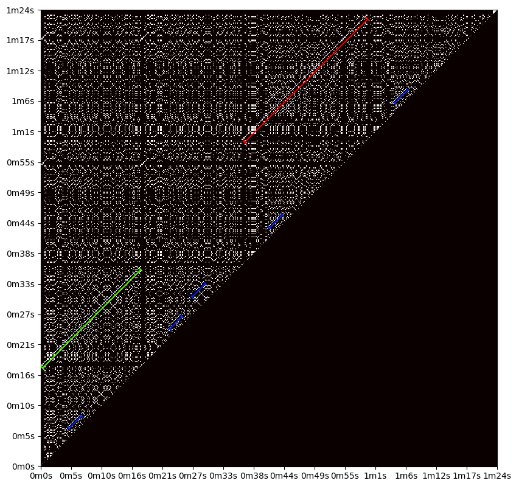

# Samopodobieństwo

Celem niniejszego eksperymentu jest zaznajomienie się z API biblioteki MusPy oraz, co najważniejsze, potwierdzenie naszych wstępnych założeń dotyczących powtarzalności motywów (przewodnich) w muzyce.

Metryka na jest mocno uproszczonym wyrażeniem podobieństwa utworu przesuniętego o kolejne jednostki czasowego do siebie samego. Jako jednostka przesunięcia została użyta szesnastka.
Wynikiem jest binarna macierz górnotrójkątna, gdzie obecność wartości (1) oznacza wystąpienie identycznej nuty w różnych punktach czasowych.
Sprawdzenie przekątnej macierzy zostało pominięte, ponieważ utwór bez przesunięcia zawsze jest w pełni podobny do samego siebie. Ograniczenie metryki do macierzy trójkątnej wynika z symetryczności porównania.

Przykład użycia metryki wizualizuje poniższa grafika wygenerowana dla utworu o indeksie 001 ze zbioru MusicNet:

Zaznaczone kolorowymi prostokątami linie przekątne równoległe do głównej przekątnej macierzy reprezentują powtarzający się motyw w ścieżce dźwiękowej (tj. identyczną sekwencję kolejnych nut). Istnienie takich linii potwierdza nasze przypuszczenia.

Eksperyment możliwy jest do powtórzenia za pomocą polecenia `python -m notebooks.self_similarity.plot`.
