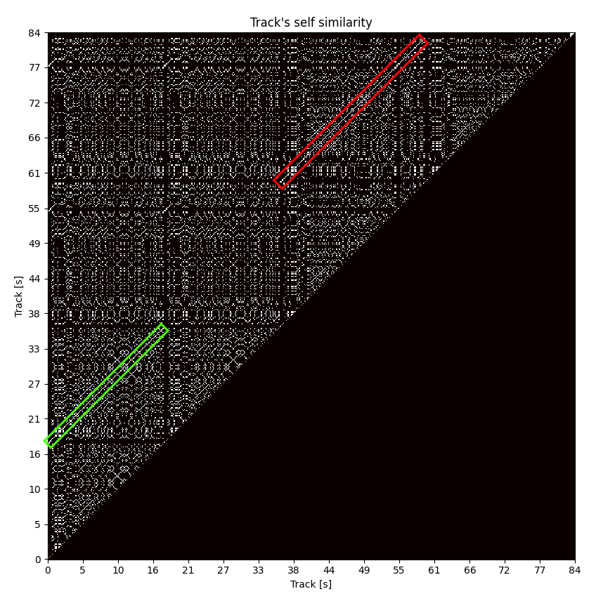

# Experiment 1 - self similarity

For this experiment we wanted to get used to MusPy API as well as prove some of our assumptions about music containing repeating fragments (aka leitmotif).

The visual metric is crude and it compares music to itself in repeating intervals. In this experiment we used a 1/16 note as interval.
The result is a triangular matrix conatining information about similarity (exact same notes being played) between different timestamps.
The matrix contains no diagonal elements, since they're perfectly similar. The other triangle is not calculated, because it is perfectly symmetrical to the first triangle, assuming the similarity metric is similar as well (which it is in our case).

We represented the matrix as a heatmap for a sample song and this is the result:

The colored diagonal lines represent repeating notes at different times of the composition, which is exactly what we were looking for.

To run the experiment run `python -m notebooks.self_similarity`.
