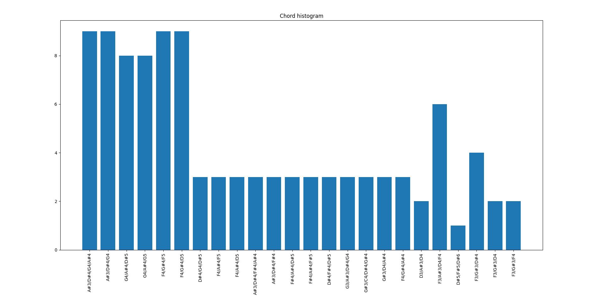

# Eksperyment 2 - akordy

Celem eksperymentu jest zaprezentowanie działania zaimplementowanych metryk opierających się na akordach oraz wizualizacja otrzymanych wyników. Poprzez akord jest rozumiane zjawisko, w którym trzy lub więcej dźwięków brzmi równocześnie.

Wprowadzone zostały dwie nowe metryki: histogram akordów oraz macierz przejść akordów. Obie z nich bazują na tym samym algorytmie do rozpoznawania i ekstrakcji akordów.

Przykład użycia metryki do obliczania macierzy przejść akordów wizualizuje poniższa grafika:

Przykład użycia metryki do obliczania histogramu akordów wizualizuje tymczasem poniższa grafika:

Obie wizualizacje metryk zostały wygenerowane dla utworu o indkesie 148 ze zbioru MusicNet (tytuł utworu to "L.v.Beethoven 3mov - Piano Sonata No.4 in Eb Major Op.7")

Histogram akordów przedstawia rozkład i ilość wystąpień poszczególnych akordów w utworze. 
Macierz przejść akordów przedstawia graficznie prawdopodbieństwa przejścia z jednego akordu do nastepnego (prawdopodobieństwo podane od w skali 0. do 1.). Kolorowe punkty na mapie reprezentują przejście z  akordu na skali 'Y' do znajdującego się odpowiednieka na skali 'X'. Akordy rozpoznane najwcześniej znajdują się na początku układu współrzędnych, natomiast najpóźniej rozpoznane są na ich krańcach. To tłumaczy pojawiająca się, przesuniętą o jedną pozycję, przekątna linia przejść. 

Eksperyment jest możliwy do powtórzenia za pomocą polecenia `python -m notebooks.chords`