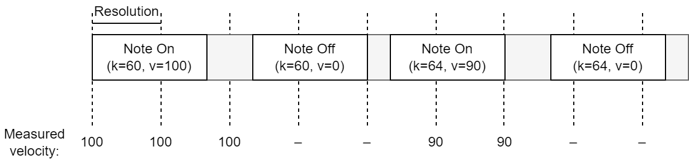
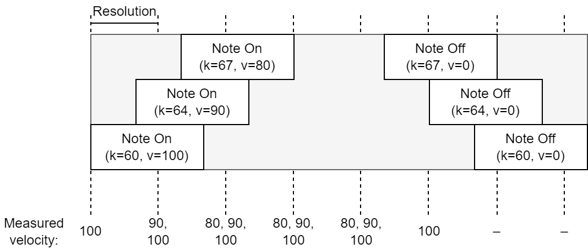
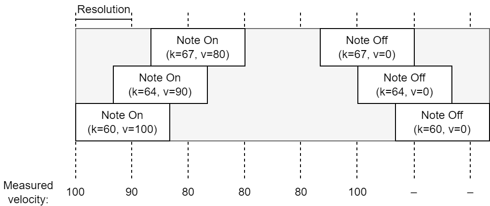
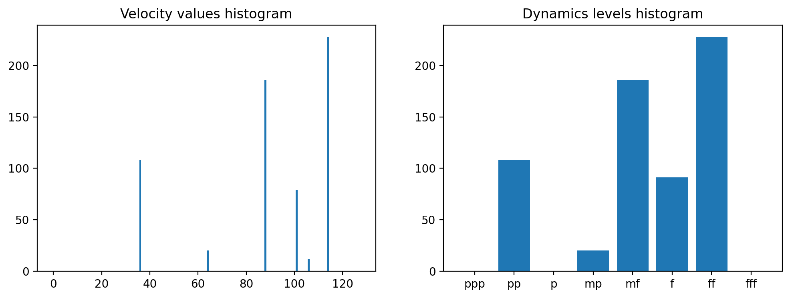

# Eksperyment #? - miary oparte o dynamikę

W ramach projektu zaproponowane zostały statystyczne miary opisujące dynamikę utworu, cytując:

> liczba zmian głośności: stopniowych (crescendo, decresendo; sąsiedztwo głośności zbliżonych, np. p -> mp) oraz nagłych (sąsiedztwo głośności skrajnych, np. p -> f; akcenty), z podziałem na instrumenty lub całościowo dla utworu

Finalnie metryki te przybrały postać trzech statystyk:

- histogramu wartości dynamiki,
- macierzy przejść wartości dynamiki,
- stosunkowi zmienności dynamiki.

## Opis opracowanych metryk

Każda z poniższych metryk umożliwia uruchomienie w dwóch trybach:

- **tryb podstawowy** (`dynamics`) działa na podstawie nieprzetworzonych wartości `velocity` wiadomości MIDI,
- **tryb poziomów** (`dynamics_levels`) dokonuje mapowania wartości `velocity` na poziomy dynamiki, co pozwala na pracę z systemem abstrakcji bliższym środowiskom muzycznym.

Aby zmniejszyć wpływ długich wartości nutowych na statystyki, wartość dynamiki mierzy się w określonych punktach czasowych, równo oddalonych od siebie o jednostkę zwaną rozdzielczością (`resolution`) i podawaną w tickach. Domyślna wartość jednostki wynosi 16, przy wywoływaniu funkcji można jednak ją nadpisać.

  
&nbsp;*Rys. 1. Sposób pomiaru wartości dynamiki na przykładzie ścieżki utworu jednogłosowego. Punkty pomiarowe rozdzielone są wartością Resolution*

  
&nbsp;*Rys. 2. Sposób pomiaru wartości dynamiki na przykładzie ścieżki utworu wielogłosowego. Punkty pomiarowe rozdzielone są wartością Resolution*

Powyższy rysunek pokazuje, że w każdej jednostce czasowej przetwarzana mogła być więcej niż jedna nuta. W przypadku metryk operujących na ciągłej, logicznie połączonej sekwencji dźwięków konieczne było ograniczenie tej liczby do 1. Zastosowany został podstawowy algorytm oddzielenia głównej melodii od dźwięków pobocznych - uwzględnianie tylko najwyżej położonych nut w każdym punkcie czasowym.

  
&nbsp;*Rys. 3. Sposób pomiaru wartości dynamiki na przykładzie ścieżki utworu wielogłosowego z ograniczeniem do 1 nuty na punkt pomiarowy. Punkty pomiarowe rozdzielone są wartością Resolution*

### Histogram wartości

Funkcje:

compute_dynamics_histogram

Argumenty:

- `music` - badany utwór (obiekt typu `muspy.Music`),
- `track_idx` - numer badanej ścieżki,
- `resolution` - odstęp pomiędzy momentami próbkowania wartości dynamiki; domyślnie 16,
- `track_start` - pozycja czasowa pierwszej próbki (odległość od początku utworu); domyślnie równa momentowi wystąpienia pierwszej nuty w ścieżce,
- `track_end` - maksymalna przetwarzana pozycja czasowa; domyślnie równa momentowi zakończenia wykonywania ostatniej aktywnej nuty w ścieżce

compute_dynamics_levels_histogram

Argumenty:

- `music` - badany utwór (obiekt typu `muspy.Music`),
- `track_idx` - numer badanej ścieżki,
- `dynamics_levels` - lista poziomów głośności, na które mapowane są wartości `velocity` nut; jest to lista dolnych granic, górną granicę stanowi wartość kolejna pomniejszona o 1 (wartości musza być uporządkowane rosnąco),
- `resolution` - odstęp pomiędzy momentami próbkowania wartości dynamiki; domyślnie 16,
- `track_start` - pozycja czasowa pierwszej próbki (odległość od początku utworu); domyślnie równa momentowi wystąpienia pierwszej nuty w ścieżce,
- `track_end` - maksymalna przetwarzana pozycja czasowa; domyślnie równa momentowi zakończenia wykonywania ostatniej aktywnej nuty w ścieżce

Histogram wartości dynamicznych pozwala na łatwe zapoznanie się z rozkładem poziomów dynamiki w utworze. Korzystając z metryki, można zauważyć niezwiązane z ułożeniem w czasie odstępstwa od normy, takie jak zbyt duży udział wartości skrajnych lub brak wartości dominującej.

![Przykład histogramu wyliczonego dla utworu nr 2433 ze zbioru MusicNet. Po lewej metryka w trybie podstawowym, po prawej w trybie poziomów[^logicpro]](./img/dynamics-histogram-musicnet-2433-t1.png)  
&nbsp;*Rys. 4. Przykład histogramu wyliczonego dla utworu nr 2433 ze zbioru MusicNet. Po lewej metryka w trybie podstawowym, po prawej w trybie poziomów[^logicpro]*

Stworzenie histogramu odbywa się poprzez zliczenie wystąpień wartości dynamiki w punktach czasowych definiowanych parametrem `resolution`. Pod uwagę brane są wszystkie nuty aktywne w danym punkcie czasowym.

### Macierz przejść wartości

Funkcje:

compute_dynamics_transition_matrix

Argumenty:

- `music` - badany utwór (obiekt typu `muspy.Music`),
- `track_idx` - numer badanej ścieżki,
- `resolution` - odstęp pomiędzy momentami próbkowania wartości dynamiki; domyślnie 16,
- `track_start` - pozycja czasowa pierwszej próbki (odległość od początku utworu); domyślnie równa momentowi wystąpienia pierwszej nuty w ścieżce,
- `track_end` - maksymalna przetwarzana pozycja czasowa; domyślnie równa momentowi zakończenia wykonywania ostatniej aktywnej nuty w ścieżce

compute_dynamics_levels_transition_matrix

Argumenty:

- `music` - badany utwór (obiekt typu `muspy.Music`),
- `track_idx` - numer badanej ścieżki,
- `dynamics_levels` - lista poziomów głośności, na które mapowane są wartości `velocity` nut; jest to lista dolnych granic, górną granicę stanowi wartość kolejna pomniejszona o 1 (wartości musza być uporządkowane rosnąco),
- `resolution` - odstęp pomiędzy momentami próbkowania wartości dynamiki; domyślnie 16,
- `track_start` - pozycja czasowa pierwszej próbki (odległość od początku utworu); domyślnie równa momentowi wystąpienia pierwszej nuty w ścieżce,
- `track_end` - maksymalna przetwarzana pozycja czasowa; domyślnie równa momentowi zakończenia wykonywania ostatniej aktywnej nuty w ścieżce

Macierz przejść pomiędzy wartościami dynamicznymi pozwala poznać szczegóły zmian dynamiki. Istotne jest, jak często przejścia są stopniowe (np. na kolejny poziom), a jak często gwałtowne, skokowe. Macierz przejść pozwala na wygodne odczytanie tej informacji.

![Przykład macierzy przejść wyliczonej dla utworu nr 2433 ze zbioru MusicNet. Po lewej metryka w trybie podstawowym, po prawej w trybie poziomów[^logicpro]](./img/dynamics-matrix-musicnet-2433-t1.png)  
&nbsp;*Rys. 5. Przykład macierzy przejść wyliczonej dla utworu nr 2433 ze zbioru MusicNet. Po lewej metryka w trybie podstawowym, po prawej w trybie poziomów[^logicpro])*

Domyślne ustawienia nie ignorują przejść w tę samą wartość. Zwykle dominują one metrykę, ale zawsze może się tu pojawić warte wychwycenia odstępstwo od normy. Aby jednak wizualizacja była bardziej szczegółowa dla pozostałych typów przejść, warto wyzerować główną przekątną.

![Przykład macierzy przejść wyliczonej dla utworu nr 2433 ze zbioru MusicNet. Po lewej metryka w trybie podstawowym, po prawej w trybie poziomów[^logicpro]](./img/dynamics-matrix-zero-musicnet-2433-t1.png)  
&nbsp;*Rys. 6. Przykład macierzy przejść wyliczonej dla utworu nr 2433 ze zbioru MusicNet. Po lewej metryka w trybie podstawowym, po prawej w trybie poziomów[^logicpro])*

Rozpatrywanie przejść wymaga istnienia pojedynczej sekwencji dźwięków, więc w tym przypadku w każdym punkcie pomiarowym przetwarzana była maks. 1 nuta (jak na [rys. 3](#rys-3)).

### Stosunek zmienności

Funkcje:

compute_dynamics_variability

Argumenty:

- `music` - badany utwór (obiekt typu `muspy.Music`),
- `track_idx` - numer badanej ścieżki,
- `difference_levels` - lista kategorii różnic, określających znaczność zmian wartości `velocity` nut; jest to lista dolnych granic, górną granicę stanowi wartość kolejna pomniejszona o 1 (wartości musza być uporządkowane rosnąco),
- `resolution` - odstęp pomiędzy momentami próbkowania wartości dynamiki; domyślnie 16,
- `track_start` - pozycja czasowa pierwszej próbki (odległość od początku utworu); domyślnie równa momentowi wystąpienia pierwszej nuty w ścieżce,
- `track_end` - maksymalna przetwarzana pozycja czasowa; domyślnie równa momentowi zakończenia wykonywania ostatniej aktywnej nuty w ścieżce

compute_dynamics_levels_variability

Argumenty:

- `music` - badany utwór (obiekt typu `muspy.Music`),
- `track_idx` - numer badanej ścieżki,
- `difference_levels` - lista kategorii różnic, określających znaczność zmian wartości `velocity` nut; jest to lista dolnych granic, górną granicę stanowi wartość kolejna pomniejszona o 1 (wartości musza być uporządkowane rosnąco),
- `dynamics_levels` - lista poziomów głośności, na które mapowane są wartości `velocity` nut; jest to lista dolnych granic, górną granicę stanowi wartość kolejna pomniejszona o 1 (wartości musza być uporządkowane rosnąco),
- `resolution` - odstęp pomiędzy momentami próbkowania wartości dynamiki; domyślnie 16,
- `track_start` - pozycja czasowa pierwszej próbki (odległość od początku utworu); domyślnie równa momentowi wystąpienia pierwszej nuty w ścieżce,
- `track_end` - maksymalna przetwarzana pozycja czasowa; domyślnie równa momentowi zakończenia wykonywania ostatniej aktywnej nuty w ścieżce

Miarą streszczającą zawartość macierzy przejść jest "zmienność dynamiki" zdefiniowana w niniejszym dokumencie jako stosunek przejść, w których następuje zmiana wartości dynamiki do ogólnej liczby takich przejść. Metrykę można rozumieć również jako sumę elementów macierzy przejść z wyzerowaną przekątną do sumy elementów pełnej macierzy przejść.

Metryka przybliża za pomocą pojedynczej liczby zmienność dynamiki w badanym utworze. Dodatkowo dostępny jest tryb pracy pozwalający na podział zmian na określone kategorie, w szczególności zmiany stopniowe i skokowe.

![Miara zmienności wyliczona dla utworu nr 2433 ze zbioru MusicNet. W pierwszym wierszu metryka w trybie podstawowym, w drugim i trzecim w trybie poziomów[^logicpro] i dla różnych kategorii zmienności](./img/dynamics-variability-musicnet-2433-t1.png)  
&nbsp;*Rys. 7. Miara zmienności wyliczona dla utworu nr 2433 ze zbioru MusicNet. W pierwszym wierszu metryka w trybie podstawowym, w drugim i trzecim w trybie poziomów[^logicpro] i dla różnych kategorii zmienności)*

## Przykłady działania metryk

Przykładem może być element zbioru MusicNet - 3 część Sonaty fortepianowej D-dur Franciszka Schuberta (identyfikator 1777).

Muzyka romantyczna - spora zmienność dynamiki.

Przykład: ...

## Ocena przydatności opracowanych miar w uczeniu maszynowym

[^logicpro]: Zgodnie z poziomami zdefiniowanymi w oprogramowaniu Logic Pro.
